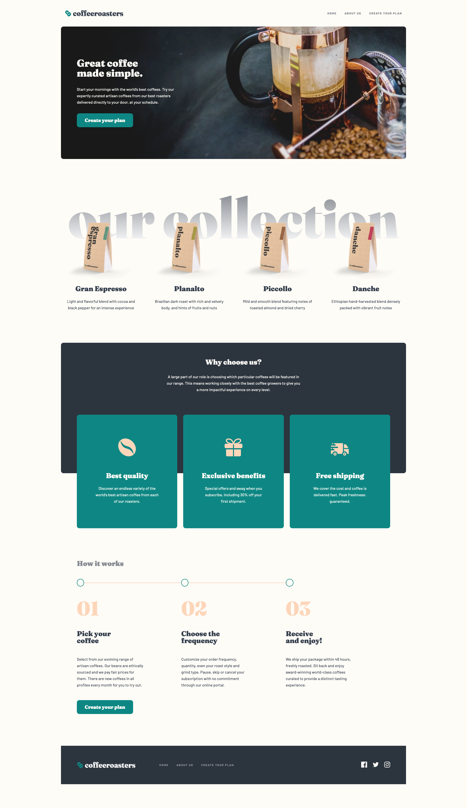
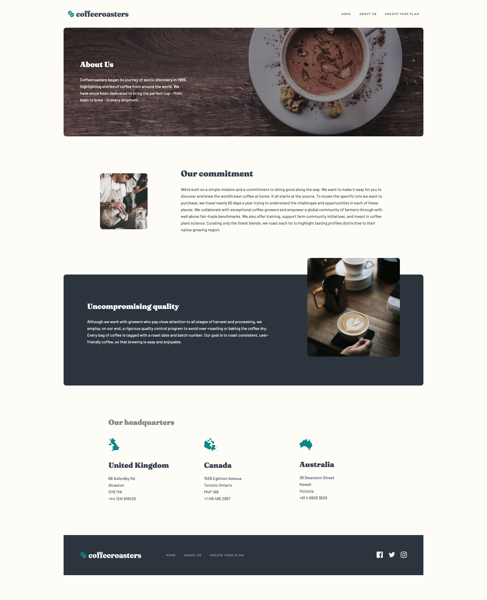
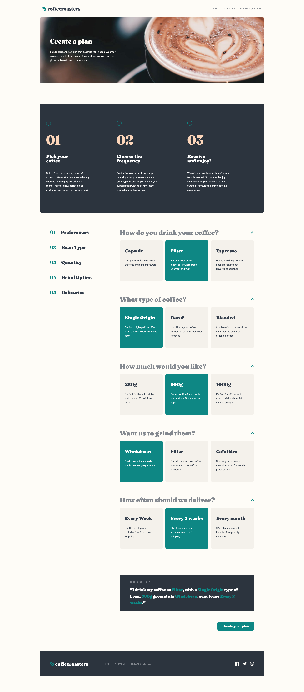

# Frontend Mentor - Coffeeroasters subscription site solution

This is a solution to the [Coffeeroasters subscription site challenge on Frontend Mentor](https://www.frontendmentor.io/challenges/coffeeroasters-subscription-site-5Fc26HVY6). Frontend Mentor challenges help you improve your coding skills by building realistic projects.

## Table of contents

- [Overview](#overview)
  - [The challenge](#the-challenge)
  - [Screenshots](#screenshot)
  - [Links](#links)
- [My process](#my-process)
  - [Built with](#built-with)
  - [What I learned](#what-i-learned)
  - [Useful resources](#useful-resources)
- [Author](#author)

## Overview

### The challenge

Users should be able to:

- View the optimal layout for each page depending on their device's screen size
- See hover states for all interactive elements throughout the site
- Make selections to create a coffee subscription and see an order summary modal of their choices

### Screenshots

### Links

- Solution URL: [https://github.com/RyanNolan1/coffee-roaster-site/tree/main](https://github.com/RyanNolan1/coffee-roaster-site/tree/main)
- Live Site URL: [https://ryannolan1.github.io/coffee-roaster-site/index.html](https://ryannolan1.github.io/coffee-roaster-site/index.html)

## My process

### Built with

- Semantic HTML5 markup
- CSS custom properties
- JavaScript
- Flexbox
- CSS Grid
- Mobile-first workflow

### What I learned

I really enjoyed making this site and learnt a ton in the process, such as how to use media queries more effectively, building websites mobile first and learning to take my time thinking about a problem instead of just jumping into coding straight away.

### Useful resources

- [Conquering Responsive Layouts](https://courses.kevinpowell.co/conquering-responsive-layouts) - This helped me massively in making the entire site responsive.

- [Build Responsive Real-World Websites with HTML and CSS](https://www.udemy.com/course/design-and-develop-a-killer-website-with-html5-and-css3/) - Another great resource for learning responsive website design.

## Author

- Website - [Ryan Nolan](http://ryannolan.uk/)
- LinkedIn - [ryan-nolan1](https://www.linkedin.com/in/ryan-nolan1/)
- GitHub - [RyanNolan1](https://github.com/RyanNolan1/)
